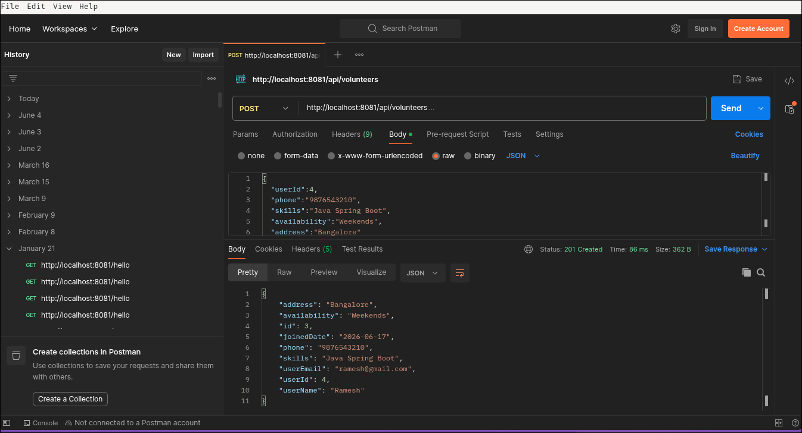
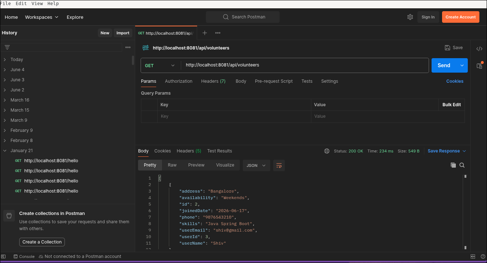
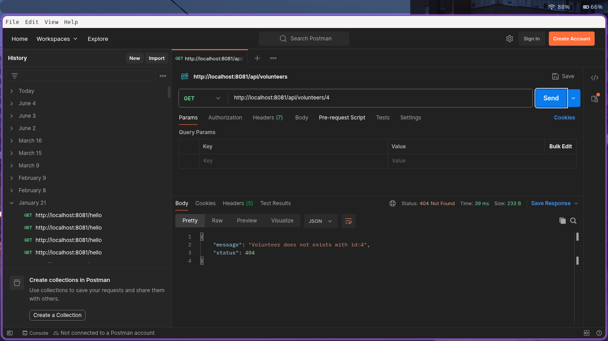

# Volunteer Information Management System

## Overview

This project is a simple Volunteer Information Management System developed using Spring Boot and PostgreSQL. It helps manage volunteer information by providing APIs to create, view, update, and delete volunteer records.

The project was developed as part of a Backend Development Internship selection task.

## Features

* User Management
* Volunteer Management
* Create Volunteer
* View All Volunteers
* View Volunteer by ID
* Update Volunteer Details
* Delete Volunteer
* PostgreSQL Database Integration
* Global Exception Handling

## Screenshots

## Create Volunteer API

## Get All Volunteers

## Exception Handling

## Tech Stack

* Java 17
* Spring Boot
* Spring Data JPA
* PostgreSQL
* Maven
* Lombok

## Project Structure

* Controller Layer
* Service Layer
* Repository Layer
* DTO Layer
* Entity Layer
* Exception Handling Layer

## API Endpoints

### User APIs

* POST /api/users
* GET /api/users
* GET /api/users/{id}
* PUT /api/users/{id}
* DELETE /api/users/{id}

### Volunteer APIs

* POST /api/volunteers
* GET /api/volunteers
* GET /api/volunteers/{id}
* PUT /api/volunteers/{id}
* DELETE /api/volunteers/{id}

## Database

The application uses PostgreSQL as the database and Hibernate/JPA for ORM.

## Future Improvements

* Authentication and Authorization
* Admin Dashboard
* Event Management
* Volunteer Assignment Tracking

## Author

Shivanand Madar
B.Tech Information Science and Engineering
UVCE, Bengaluru
